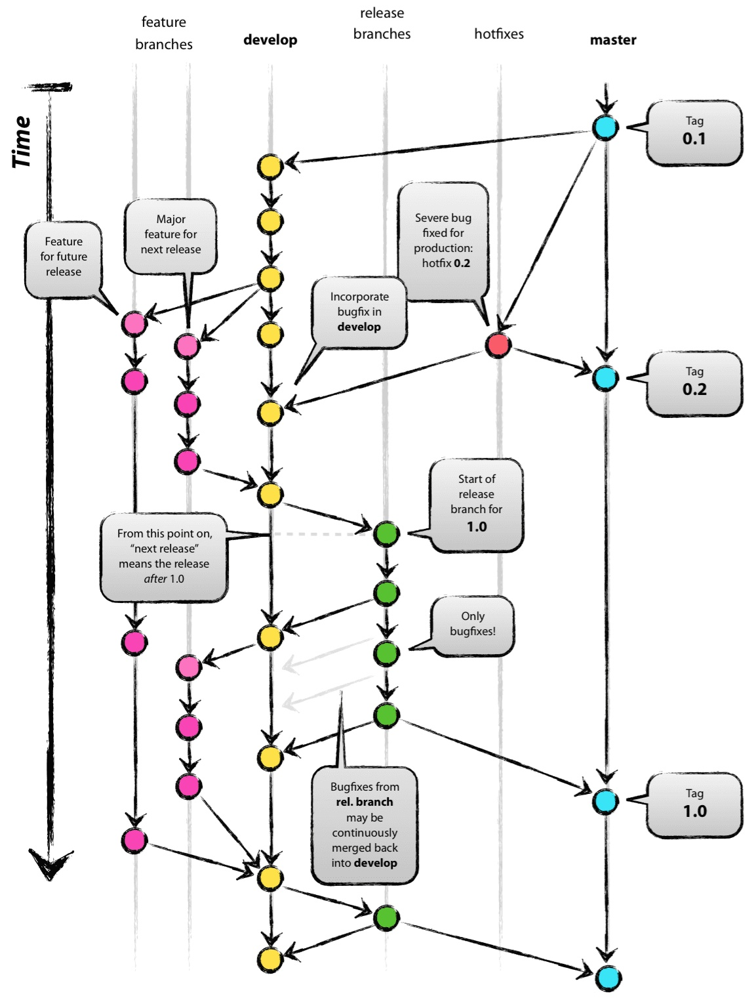

## Git 分支管理
* [Gitflow Workflow](https://www.atlassian.com/git/tutorials/comparing-workflows)
* [A successful Git branching model](http://nvie.com/posts/a-successful-git-branching-model/)
* [Git分支管理策略](http://www.ruanyifeng.com/blog/2012/07/git.html)
* [Git flow 使用](https://www.cnblogs.com/lcngu/p/5770288.html)

Git 在技术层面上，绝对是一个无中心的分布式版本控制系统，但在管理层面上，建议保持一个中心版本库。

### 主分支  
* 建议一个中心版本库(我们叫它`origin`)至少包括两个分支，即“主分支(`master`)”和“开发分支(`develop`)”
* 要确保：团队成员从主分支(`master`)获得的都是处于可发布状态的代码，而从开发分支(`develop`)应该总能够获得最新开发进展的代码。

### 辅助分支  
* 在一个团队开发协作中，我建议，要有“辅助分支”的概念。
* “辅助分支”，大体包括如下几类：“管理功能开发”的分支、“帮助构建可发布代码”的分支、“可以便捷的修复发布版本关键BUG”的分支，等等。
* “辅助分支”的最大特点就是“生命周期十分有限”，完成使命后即可被清除。
* 建议至少还应设置三类“辅助分支”，我们称之为“`Feature branches`”，“`Release branches`”，“`Hotfix branches`”。

至此，我们形成了如下这张最重要的组织图，包含了两个粗体字分支（`master`/`develop`）和三个细体字分支（`feature`/`release`/`hotfixes`）。



### Feature branches  

* “`Feature branches`”，起源于 `develop` 分支，最终也会归于 `develop` 分支。
* “`Feature branches`”常用于开发一个独立的新功能，且其最终的结局必然只有两个，其一是合并入 `develop` 分支，其二是被抛弃。最典型的“`Fearture branches`”一定是存在于团队开发者那里，而不应该是“中心版本库”中。

创建“Feature branches”：
```bash
git checkout -b feature01 develop   ## 切换到新分支 “feature01”
## 在 “feature01” 完成开发
git checkout devleop                ## 切换到分支 "develop"
git merge --no-ff feature01         ## 合并分支
git branch -d feature01             ## 删除分支 “feature01”
git push origin develop             ## 推送分支 "develop"
```
>`--no-ff`，即not fast forward，其作用是：要求 `git merge` 即使在fast forward条件下也要产生一个新的 `merge commit`
>（此处要求采用`--no-ff`的方式进行分支合并，其目的在于，希望保持原有“`Feature branches`”整个提交链的完整性）  

### Release branch  
* “Release branch”，起源于`develop`分支，最终归于 `develop` 或 `master` 分支。这类分支建议命名为 `release-*`
* “`Relase branch`”通常负责“短期的发布前准备工作”、“小bug的修复工作”、“版本号等元信息的准备工作”。与此同时，`develop` 分支又可以承接下一个新功能的开发工作了。
* “`Release branch`”产生新提交的最好时机是“`develop`”分支已经基本到达预期的状态，至少希望新功能已经完全从“`Feature branches`”合并到 `develop` 分支了。

创建“Release branches”：
```bash
git checkout -b release-1.2 develop
```

在一段短时间内，在“Release branches”上，我们可以继续修复bug。在此阶段，严禁新功能的并入，新功能应该是被合并到 `develop` 分支的。

经过若干bug修复后，“Release branches”上的代码已经达到可发布状态，此时，需要完成三个动作：第一是将“Release branches”合并到 `master` 分支，第二是一定要为 `master` 上的这个新提交打TAG（记录里程碑），第三是要将“Release branches”合并回 `develop` 分支。
```bash
git checkout master
git merge --no-ff release-1.2
git tag -a 1.2
git checkout develop
git merge --no-ff release-1.2
git branch -d release-1.2
```
（使用-u/-s/-a参数会创建tag对象，而非软tag）  

### Hotfix branches  
* “Hotfix branches” 源于 `master`，归于 `develop` 或 `master`，通常命名为 `hotfix-*`
* “Hotfix branches”类似于“Release branch”，但产生此分支总是非预期的关键BUG。
* 建议设立“Hotfix branches”的原因是：希望避免 `develop` 分支新功能的开发必须为BUG修复让路的情况。

建立 “Hotfix branches”：
```bash
git checkout -b hotfix-1.2.1 master
```

BUG修复后，需要将“Hotfix branches”合并回 `master` 分支，同时也需要合并回 `develop` 分支，方法是：
```bash
git checkout master
git merge --no-ff hotfix-1.2.1
git tag -a 1.2.1
git checkout develop
git merge --no-ff hotfix-1.2.1
git branch -d hotfix-1.2.1
```

可以将组织图图打印出来，贴在写字台的墙壁上，随时参考。